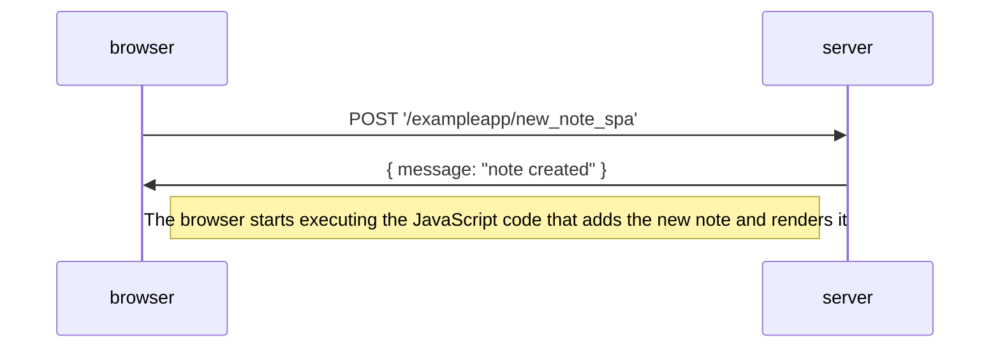

```mermaid
sequenceDiagram
    participant browser
    participant server

    browser->>server: POST '/exampleapp/new_note_spa'
    server->>browser: { message: "note created" }

    Note right of browser: The browser starts executing the JavaScript code that adds the new note and renders it
```
